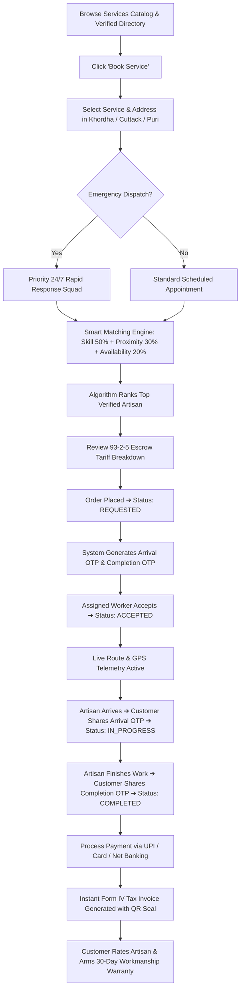
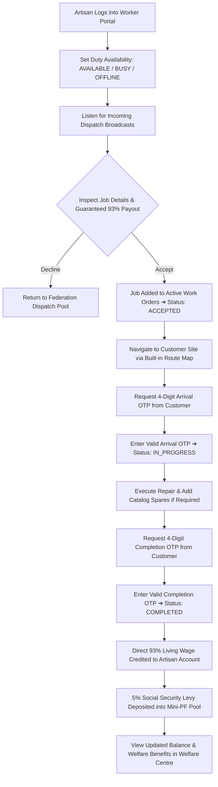
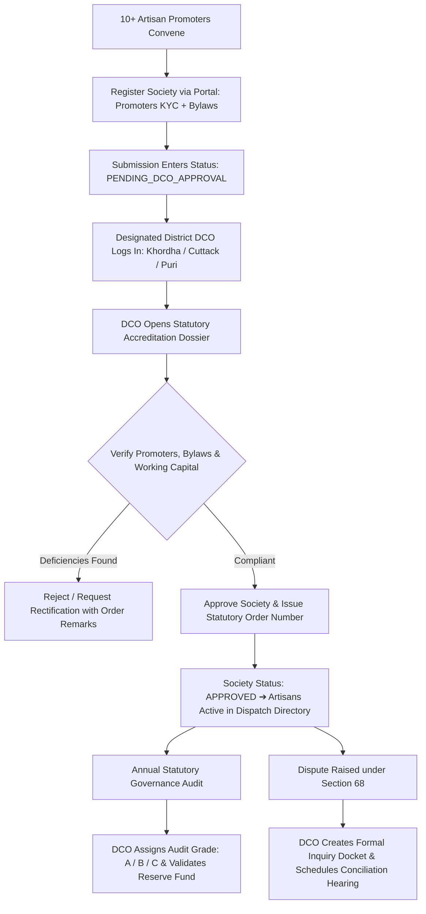
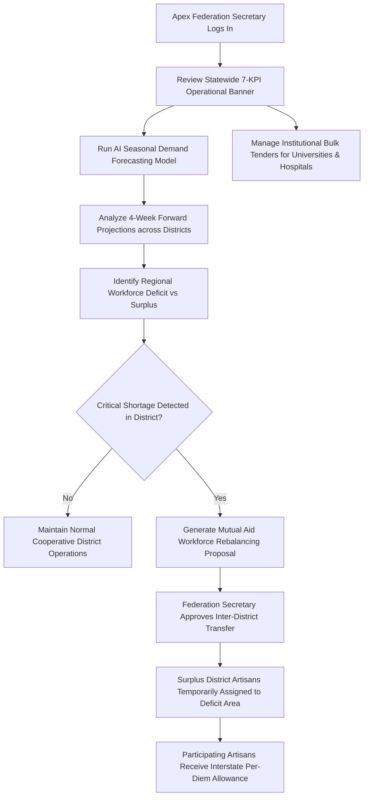

# 🔄 System Workflows & User Journeys — Prithvi Fix

This document outlines the detailed user journeys, state transitions, and Mermaid process diagrams for the four key platform actors:
1. **👤 Citizen / Customer Journey**
2. **👷 Artisan / Worker Member Journey**
3. **🏛️ Primary Cooperative Society & District DCO Statutory Journey**
4. **🏢 State Apex Federation & Mutual Aid Workforce Journey**

---

## 1. 👤 Citizen / Customer Journey

### Detailed Customer Step Breakdown:
1. **Catalog Exploration**: Citizen browses standardized service tariffs across 12 trade categories with transparent base pricing.
2. **Interactive Booking Wizard**: 4-step wizard capturing exact trade requirements, service location, and scheduling preferences.
3. **Smart Matching Recommendation**: The backend recommendation engine ranks artisans in the locality using weighted composite scoring:
   $$\text{Score} = (\text{Skill Match} \times 0.50) + (\text{Proximity} \times 0.30) + (\text{Availability} \times 0.20)$$
4. **Escrow Tariff Transparency**: Full visibility into the **93-2-5 escrow distribution** (93% direct artisan wage, 5% social security welfare levy, 2% platform upkeep).
5. **Anti-Fraud Dual OTP Authentication**:
   - **Arrival OTP (4 Digits)**: Kept confidential by customer until the artisan physically arrives at the doorstep.
   - **Completion OTP (4 Digits)**: Shared only after inspecting and approving the finished repair.
6. **Live Telemetry & Tracking**: Real-time Leaflet map displaying navigation route, transit distance, and estimated arrival time.
7. **Statutory Tax Invoice**: Instant download and print of the official **Odisha Labour Cooperative Society Form IV Tax Invoice** with itemized labour charges, spare parts, and statutory welfare contributions.

---

## 2. 👷 Artisan / Worker Member Journey

### Detailed Worker Step Breakdown:
1. **Duty Autonomy**: Artisan toggles duty status at will without algorithmic penalties or account deactivations.
2. **Audio-Visual Dispatch Radar**: Real-time sound notification announces incoming broadcast orders matching the artisan's trade and district.
3. **Transparent Payout Guarantee**: The order card displays the full customer address, estimated travel distance, and guaranteed net 93% wage before acceptance.
4. **Physical On-Site Verification**: The artisan validates the customer's Arrival OTP upon physical arrival, transitioning the job to `IN_PROGRESS`.
5. **Standardized Parts Catalog**: If replacement parts are needed (e.g. capacitors, valves, MCBs), the artisan selects items from the locked cooperative price catalog, preventing price gouging.
6. **Secure Job Closure**: Submitting the customer's Completion OTP closes the job and triggers instant wage settlement.
7. **Social Security Accumulation**: The 5% welfare allocation automatically credits into the worker's Mini-PF and ESIC accident policy balance.

---

## 3. 🏛️ Primary Cooperative Society & District DCO Statutory Journey

### Detailed DCO Governance Step Breakdown:
1. **Promoter Group Formation**: A group of 10+ licensed artisans registers a primary cooperative society, uploading trade credentials, bank particulars, and operational bylaws.
2. **Jurisdiction-Isolated DCO Inboxes**: District Cooperative Officers for **Khordha**, **Cuttack**, and **Puri** access strictly segregated queues containing only societies operating within their administrative jurisdiction.
3. **Statutory Dossier Audit**: The DCO inspects four audit dimensions:
   - *Promoter Artisan KYC*: Identity proofs, police clearances, and trade certificates.
   - *Working Capital & Bank Guarantee*: Verification of cooperative bank reserves.
   - *Equipment & Safety Tools Inventory*: Conformance to ISI safety standards.
   - *Statutory Bylaws*: Adherence to the 93-2-5 escrow distribution model.
4. **Accreditation Issuance**: Upon approval, the society receives an official registration order number, activating all affiliated member artisans on the public directory.
5. **Continuous Statutory Auditing**: DCOs record annual AGM compliance, assign audit classifications (Grade A, B, C), and audit the 25% statutory reserve fund.
6. **Section 68 Quasi-Judicial Proceedings**: DCOs create formal inquiry dockets to resolve territorial demarcations and consumer disputes.

---

## 4. 🏢 State Apex Federation & Mutual Aid Workforce Journey

### Detailed Apex Federation Step Breakdown:
1. **Statewide Operations Monitoring**: Real-time visibility into overall platform health, total escrow volume, and active work orders across all three districts.
2. **Predictive AI Demand Forecasting**: Algorithmic models analyze seasonal weather patterns (monsoons, summer heatwaves), historical booking volumes, and festival seasons to project 4-week trade requirements.
3. **Regional Gap Analysis**: Compares available active artisan supply against forecasted demand to identify regional deficits (e.g. surge in AC repair demand in Bhubaneswar vs surplus capacity in Puri).
4. **Inter-Cooperative Mutual Aid Dispatch**: The Apex Federation authorizes temporary cross-district workforce rebalancing agreements, deploying reserve squads without disrupting local coverage.
5. **Institutional Bulk Procurement**: The Apex Federation negotiates bulk facility maintenance tenders with public institutions (e.g., government quarters, university campuses, public hospitals), funneling steady contract volume directly to member societies.
